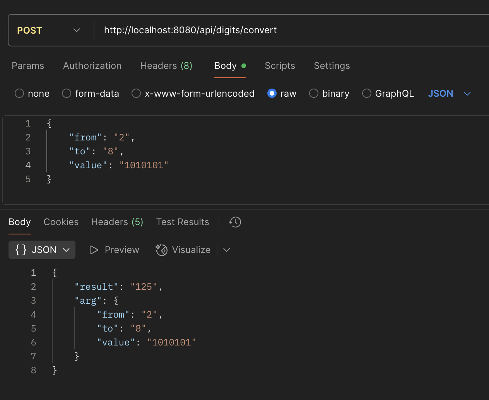
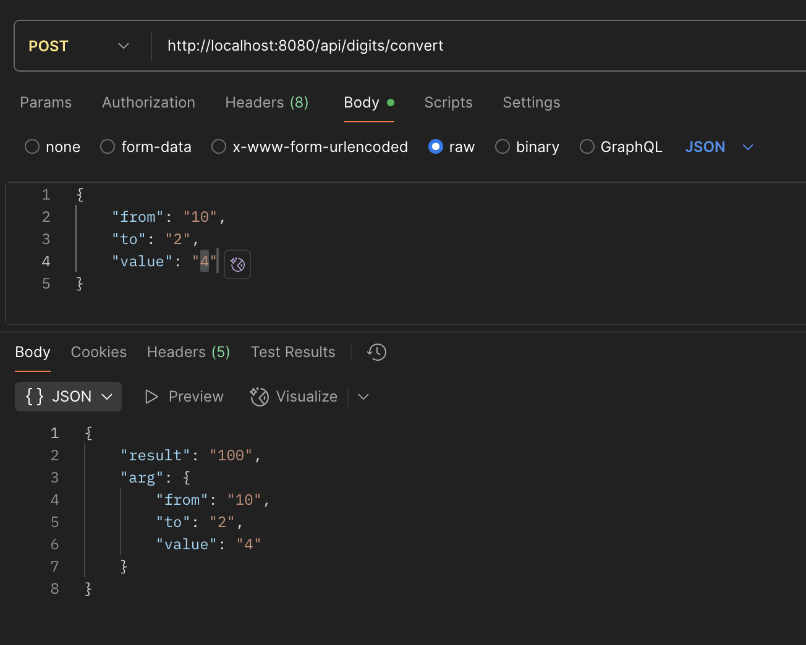
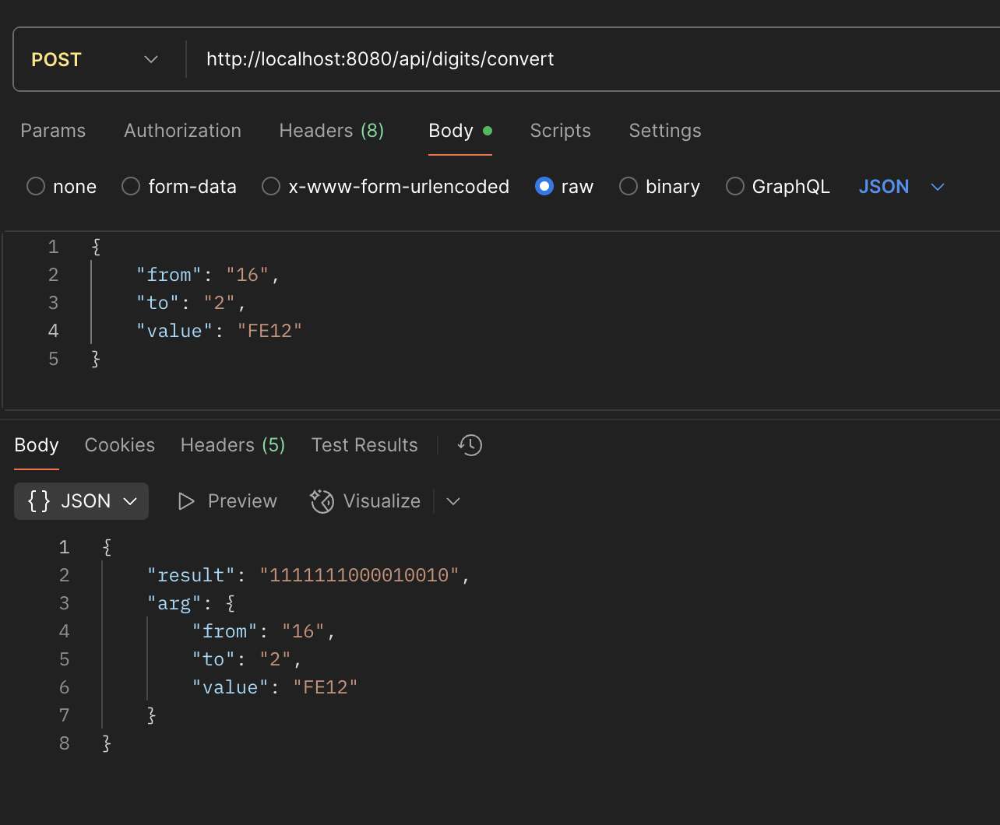
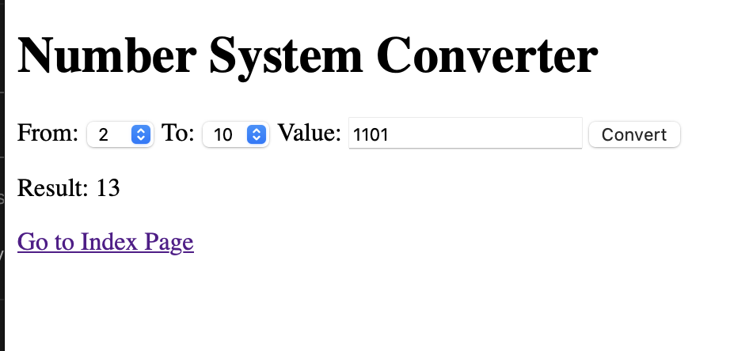
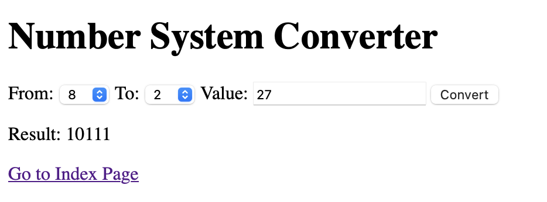
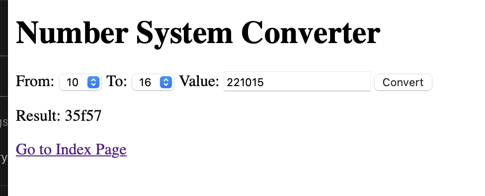

# Задание
Реализовать веб-приложение калькулятора систем счисления (c/c) по принципу «из-всех-во-все» - т.е.
с помощью приложения можно выполнить перевод целого положительного числа из одной любой c/c в 
любую другую c/c, которые поддерживаются данные приложением. Для поддержки можно выбрать разный 
набор c/c, но обязательно должны поддерживаться c/c со следующими основаниями: 2, 8, 10, 16.

Приложение должно поддерживать два типа интерфейса взаимодействия с ним:
JSON WEB API – обмен данными через http-запросы/ответы с JSON-телом
WEB-интерфейс веб-страниц (MVC, монолит)

> Требования:
> - писать проект с нуля, но опираясь на пример проекта конвертера валют из предыдущих ДЗ
> - логику конвертации вынести в отдельный компонент, внедряемый через Spring DI
> - разные типы интерфейсов взаимодействия приложения реализовать в одном проекте, но в разных пакетах
> - реализовать обработку ошибок конвертации любым удобным способом для всех случаев
> - Оформить отчет по ДЗ, приложив снимки тестирования приложения и исходный код в любом удобном виде (.docx, github, README.md со скринами).

---

---

